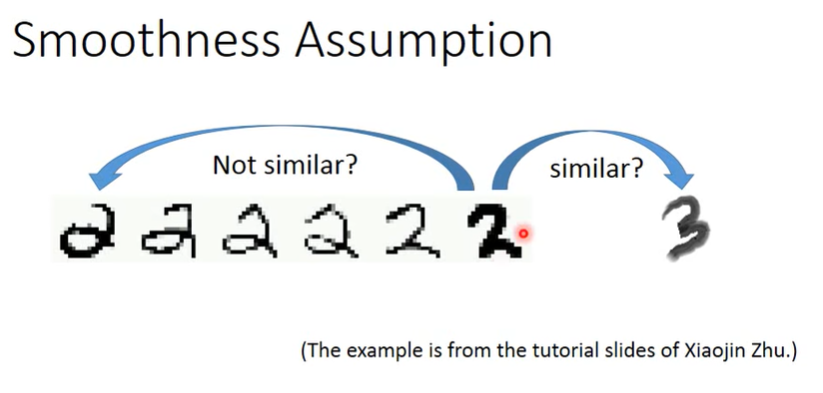
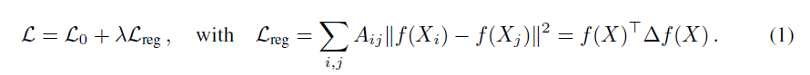
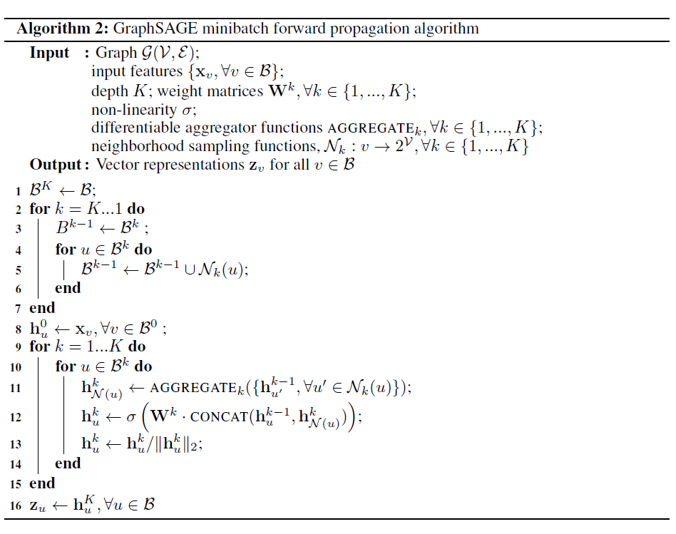

# SEMI-SUPERVISED CLASSIFICATION WITH GRAPH CONVOLUTIONAL NETWORKS

## 基础知识

无向简单图

GNN: $H^{(l+1)}=f(A,H^{(l)})$

GCN: $H^{(l+1)}=\sigma(\hat{D}^{-1/2}\hat A \hat{D}^{-1/2} H^{(l)}\theta);其中A是邻接矩阵，\hat A=A+I；D是度数对角矩阵，\hat D=D+I；加hat相当于增加一个自环，乘以\hat D^{-1/2}是对称归一化；\theta是参数$

Spectral Graph Theory

实对称矩阵可以正交对角化

Rayleigh Quotient：$\frac{x^TAx}{x^Tx}$，x是eigenvector时Rayleigh Quotient=$\lambda$

laplace matrix: $L=D-A$，对称规范化$L_{sym}=D^{-1/2}LD^{-1/2}$

* 以上两个矩阵都是实、对称、半正定的
  * $L=\sum G_{(i,j)}$，其中$G_{(i,j)}$的第i行第i列、第j行第j列为1；第i行第j列和第j行第i列为-1
  * $x^TG_{(i,j)}x=(x_i-x_j)^2;x^TLx\sum (x_i-x_j)^2;x^TL_{sym}x=\sum (x_i/\sqrt{d_i}-x_j/\sqrt{d_j})^2$
* 特征值恒小于等于2
  * $x^T|L|x=\sum x^T|G_{(i,j)}|x=\sum(x_i+x_j)^2;x^T|L_{sym}|x=\sum (x_i/\sqrt{d_i}+x_j/\sqrt{d_j})^2\ge 0$
  * 对后式展开得$x^Tx\ge -x^TD^{-1/2}AD^{-1/2}x\Rightarrow x^Tx\ge -x^TD^{-1/2}AD^{-1/2}x\Rightarrow2x^Tx\ge x^T L_{sym}x$

傅里叶：在图中卷积困难，可以转换到别的域$Lx=U\Lambda U^Tx=[\sum(x_1-x_i)\cdots \sum(x_n-x_i)]^T$

* 卷积即对$\Lambda$进行$g(\Lambda)$，其中g是多项式，而分解特征值是困难的，但$g_\theta * x=Ug(\Lambda)U^T=g(U\Lambda U^T)=g(L)$
* g使用Chebyshev多项式防止梯度消失/爆炸：$T_n(x)=2xT_{n-1}(x)-T_{n-2}(x)(T_0=1,T_1=x)$
  * Chebyshev有$T_n(\cos\theta)=\cos n\theta$，而$L_{sym}$特征值范围[0,2]，因此$L_{sym}-I$特征值可以写作cos，令$g(x)=\sum \theta_i T_i(x)$，而上述L改为$L_{sym}-I$
  * Graph Convolution: F(A)=L或$L_{sym}$相关，这里$F(A)=L_{sym}-I=U\Lambda U^T$，则$g * x=Ug(\Lambda)U^T=U(\sum \theta_kT_k(\Lambda))U^Tx=\sum\theta_k T_k(L_{sym}-I)x$
  * 取低阶近似，$g*x=\theta_0T_0(L_{sym}-I)+\theta_1(L_{sym}-I)x=\theta_0x-\theta_1D^{-1/2}AD^{-1/2}x$
  * 令$\theta_1=-\theta_0$，上式写为$g*x=\theta_0(I+D^{-1/2}AD^{-1/2})x$
  * renormalize，去除$\theta_0$，写作$\hat{D}^{-1/2}\hat A \hat{D}^{-1/2}x$

SELF-SUPERVISED

* Self-Training Method
* Co-Training Method 
* Graph-Based

Transductive Learning: testing data也可以作为未标签的数据，训练时可以用（可以额外学习到分布聚集性等信息）

Inductive Learning: testing data不可以作为未标签的数据，训练时不知道

Smoothness Assumption：

## 正文

基于平滑假设的Laplacian Regularization：

* Loss function

  $L_0$是图中有label部分的supervised loss，与图的A是邻接矩阵，$X_i$是节点i的节点特征，$\Delta=D-A,其中D_{ii}=\sum_jA_{ij}$

* 基于假设：相连的节点更有可能具有相同的label

* f是一个神经网络函数，会使得无label节点也可以从$L_0$中获得梯度信息

### 快速传播信息模型

### 半监督节点分类

# Inductive Representation Learning on Large Graphs

动机：GCN采用Transductive方法，使得它需要提前知道图的结构（邻接矩阵等），对于新的unseen point，它需要从头对整个图进行更新，计算量巨大.

SAmple+aggreGatE

采样：采样，取一阶邻居节点，使得子图连通

聚合：从最外围向内更新内部节点

