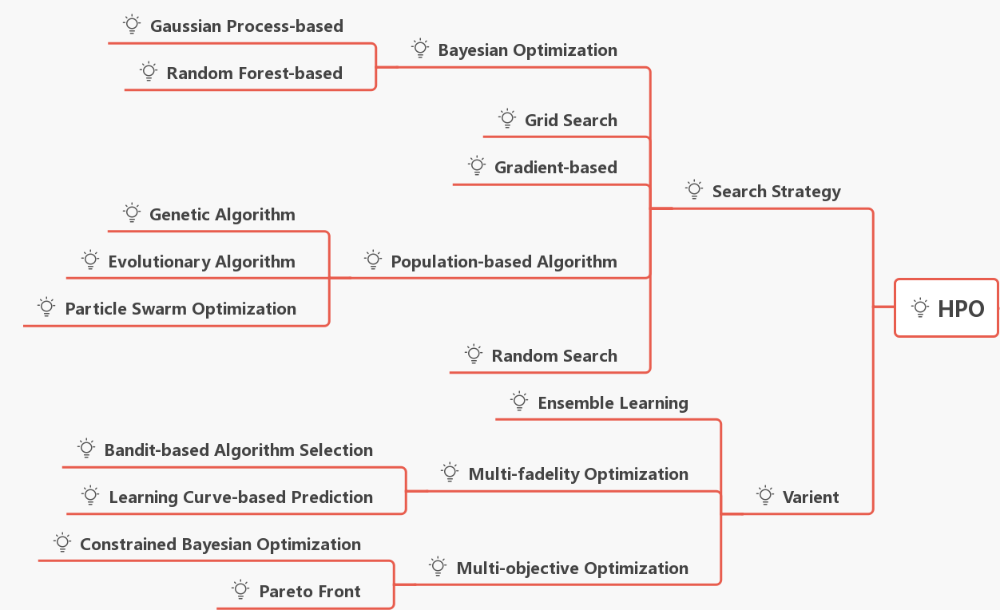
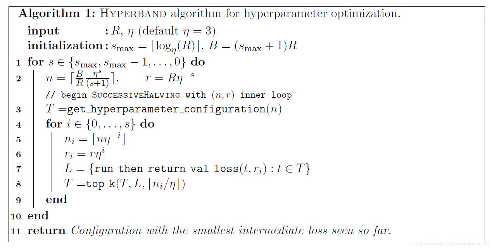
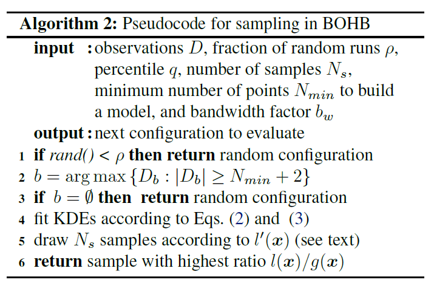

## BOHB: Robust and Efficient Hyperparameter Optimization at Scale

Frank Hutter, ICML, 2018

* HB： successive halving

  

* BO：核方法KDE，优化第三行get_hyperparameter_configuration

  

  * 第1行实际上是利用-探索，一定几率搜索
  * 第2、3行是要达到一定数量才开始拟合
  * 第5行是提高可选择的样本
  * 并行更新

## ASHA: A SYSTEM FOR MASSIVELY PARALLEL HYPERPARAMETER TUNING

MLSys Conf., 2020

* background: 传统并行在一个round进行同步以后才能进行下一个round
* 改进：round间可以并行，对于一个round k，要筛选出$1/\eta$，则在目前已有的计算完round k阶段的configurations中(集合记为rung k)挑选前$|rung\ k|/\eta$且没有进入round k+1的configurations进入round k+1，如果没有可以进入k+1的则选择一个从round 0开始
* 

## ECONOMICAL HYPERPARAMETER OPTIMIZATION WITH BLENDED SEARCH STRATEGY (Blendsearch)

ICLR, 2020

* Local search: 围绕已知的最优点附近搜索，radius与step有关+random restart (参考FLOW)
* BO: 采用TPE(Tree-structured Parzen Estimator Approach)，也是一种model
* 
* global search达到一定标准（可以用**multi-fidelity**剪枝，但论文说影响不大）以后会创建子进程进行local search
* local search选的配置会预先打分，好过进程池里半数进程则开始
* 完成local search后会和所有local search进行比较，最不好的会被剔除

## Efficient and Robust Automated Machine Learning (unfinished)

Frank Hutter, NIPS 2015

1.meta-learning step to warm-start（kgtuner stage2似乎用了同样方法）

​	collect performace data and meta-features, i.e. characteristics of dataset that can be computed efficiently

快速筛选

2.ensemble construction step

...more robust (and less prone to overfitting) than using the point estimate that standard hyperparameter optimization yields.

对于一些acquisition或者超参数选择等过于敏感，容易overfitting

用多种算法，或者restart一些不好的configurations（或者random一些点）

## Comments

---

iclr/icml 的best paper 调超参可能会泄露隐私，可能有关于安全

iclr20: old dog with new trick

