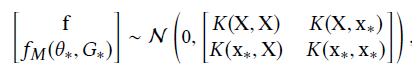
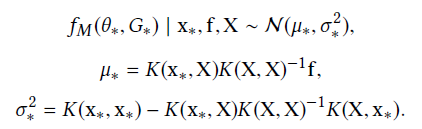
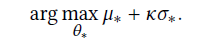
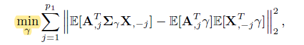
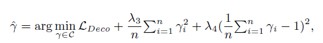
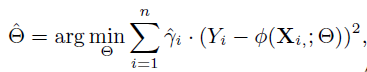
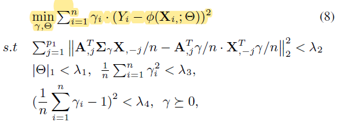
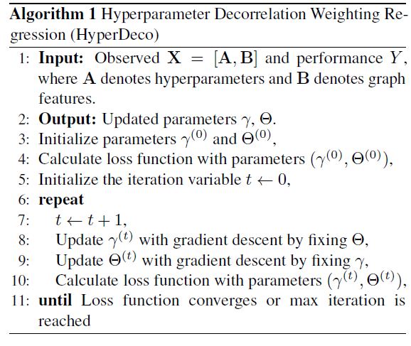
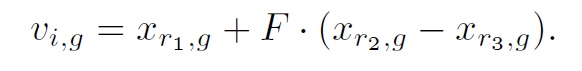
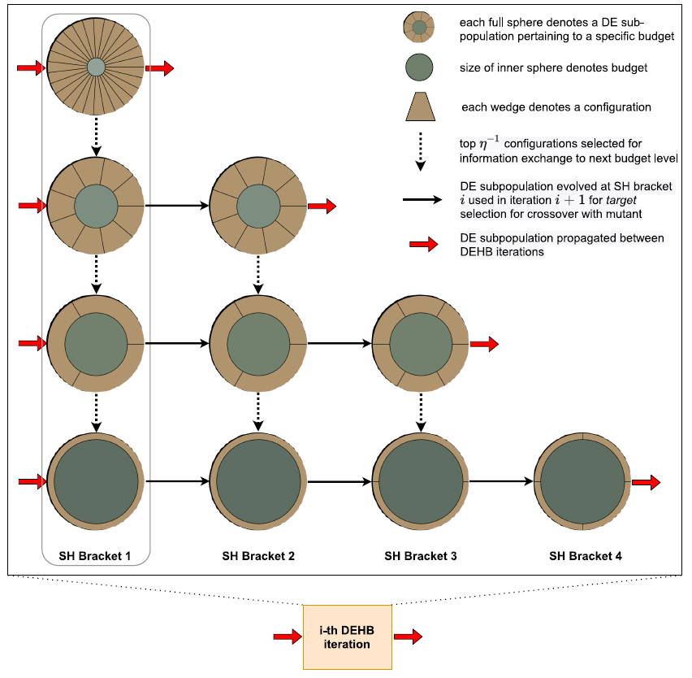

## AutoNE: Hyperparameter Optimization for Massive Network Embedding (KDD'19)

Transferability: 大图不好解耦成小图，因为其中有联系着的关系——相比于图片等，每张图片都是独立分布

Heterogeneity: 一个网络通常由高度异构的几个组件构成（**异构图**，是否能聚类？），子网络相似性、可迁移性必须考虑到异质性

**假设：俩网络结构越像，俩超参越像，那么最终NE结果越像**

signature extraction - spectral graph theory: NetLSD (SOTA for preserve the community structure - heat diffusion - 保持网络结构相似性)

**kernel能算出相似度，实验证明相关性；random walk随机性可能不是很强，kernel可以从大空间找到更好的**

**degree似乎可能有更好的随机性**

Kernel Function: $K_\theta(\theta_1,\theta_2),K_G(h(G_1),h(G_2))$，分别对应hp和图的相似性，h是对图进行编码，选用Matern 5/2 kernel function

Gaussian Process:

先验分布 $f|X\sim \mathcal{N}(\mu(X),K(X,X))$，$f(\theta_i,G_i)$是对于一个hp的评判，取$\mu(X)=0$. 现获得kernel function时需要利用极大似然估计+拟牛顿法L-BFGS-B：

$\ln p(f|X)=-\frac{1}{2}f^TK(X,X)^{-1}f-\frac{1}{2}\ln \det(K(X,X))+constant$

评判HP好坏：

于是最大化UCB：

整体步骤：

Phase 1：选子图、选HP，用NE算法评估n组效果，然后结合结果用拟牛顿法求得核函数

Phase 2：在全图上，用拟牛顿法（UCB）求出L个可能最好的HP，用NE算法跑一遍，每次跑都更新核函数，最后选出L个中最好的配置

**核函数可以改进**

## Explainable Automated Graph Representation Learning with Hyperparameter Importance (e-AutoGR  ICML'21)

主要卖点：超参与图特征解耦，利用参数使得n组超参与对应图特征的Cov最小

图特征：节点数、边数、三角数、全局聚类系数、最大度数、连通分量数，用$B\in\mathbb{R}^{n\times p_2}$表示

超参：$A\in\mathbb{R}^{n\times p_1}$

X=[A,B]

解耦(Deco)：

定理：

一定条件下$\gamma$有唯一解，此时A和X完全解耦

X->Y的预测：MLP，参数$\Theta$

两个优化合并为联合优化：

整个过程：

1. 采样若干子图，每个子图对应一个times $t_i$（epoches），并且全部跑一遍获得performance

2. loop 好多次

   * 对于所有列表中的配置，更新$\gamma,\Theta$，更新是一个联合更新，先固定一个参数，用梯度下降更新另一个，再反过来（每次从头更新）

     

   * 首先对于各个HP(dim, batch-size)等，通过MLP查看重要性，然后按照重要性降序的顺序，选取预测值最好的一个configuration，对其每次更新一个HP（sampling 1000个可能值并固定其他HP进行预测，选取最好的），更新完后加入超参列表

   * 将新加入的超参在原图上跑一遍获得ground-truth，从头loop
   
   

## DEHB: Evolutionary Hyperband for Scalable, Robust and Efficient Hyperparameter Optimization (IJCAI'21  by Frank Hutter)

Differential Evolution (DE): 使用mutation策略 rand/1 

具体来说是

其中$x$是父母，$v$是孩子，$F$是一个$(0,1]$的因子

下图中横行表示iteration，竖行表示bracket，**bracket是一个SH过程**；

每一列开始都是将紧邻的上面一层所有configurations进行DE（然后选出1/n，第一列随机sampling除外），指向下一列数量和vanilla SH相当，但是是从所谓parent pool中选取，parent pool会更新，当上一层落下来后，进行实际评估后，会和parent pool中所有已有参数进行比较并且排名、更新（每一层有一个parent pool）

该模型可并行，parent pool不必严格遵循一定顺序，各个子线程同步更新

可能不热门，novelty也不是很好，这个64个采样等等可能会限制数据集和采样空间

深度：想法，方法论（主线）；从**数据本身**挖方法论（图采样，遇到的问题，怎么采怎么利用）

广度：别的预测任务，比较foundamental，不同任务不同模型
