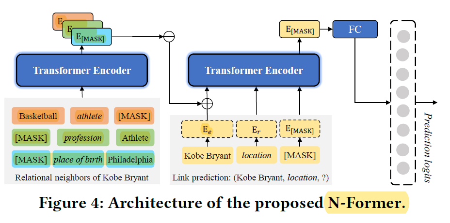
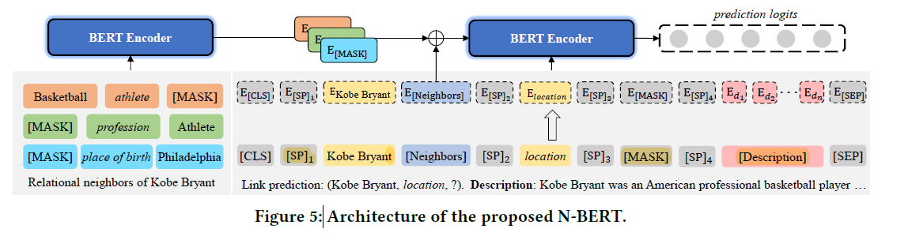
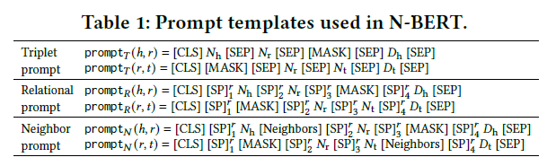
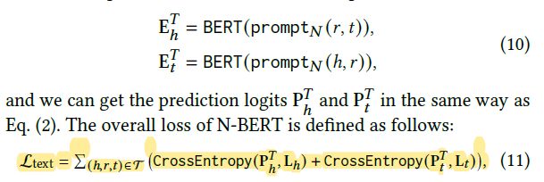
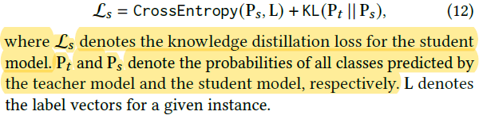
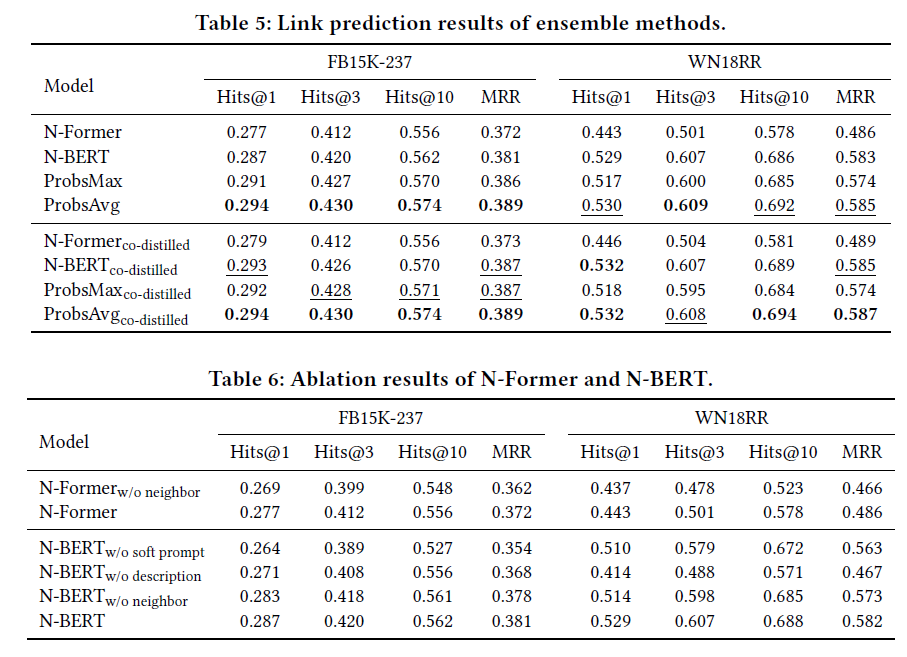

## I Know What You Do Not Know: Knowledge Graph Embedding via Co-distillation Learning  (CIKM'22)

Intro: KG在线知识蒸馏co-distillation: 结合N-Former(学习结构信息)、N-BERT(预训练语义信息)

Motivation: 语义信息存在相当多缺陷：噪音、模糊性 $\rightarrow$ 结构信息 + 语义信息 $\rightarrow$ co-distillation

Methods: 

* N-Former

  

  * Entity Mask:  (h, r, [MASK])

    $E_t=Transformer(E_h,E_r,E_{[MASK]})$

    $L_{triplet}(t)=CrossEntropy\{softmax(E_{all\ entities}\cdot MLP(E_t)),labels\}$

  * Neighborhood Info: all (h', r', h) triplets    （即使h作为头也可以使用r'的reverse将h变为尾）

    与上类似： 

    $E_{Neighbor}=\sum Transformer(E_{h'},E_{r'},E_{[MASK]})$

    $E_{t}=\sum Transformer(mean(E_{h},E_{Neighbor}),E_{r'},E_{[MASK]})$

    $L_{structure}(t)=\sum_{(h,r,t)\in\tau}L_{triplet}(t)+CrossEntropy_{neighbor}(...))\}$

* N-BERT

  

  * Prompt for NLP:

  * Soft Prompts（SP）: 

    

    

    其中$E_h$表示[MASK]作头，$E_t$表示[MASK]作尾

* Co-distillation Learning

  

​	Trick: DKD - 只选student model里rank排前一半的数据进行train

​	

以上的$L_{structure}$和(11)(14)加起来作为loss更新

Experiment:

