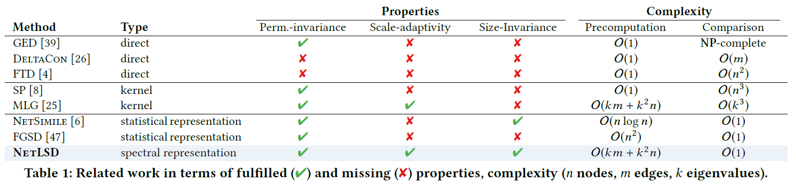

## YOU CAN TEACH AN OLD DOG NEW TRICKS! ON TRAINING KNOWLEDGE GRAPH EMBEDDINGS  (ICLR'20)

旧瓶装新酒，古早的KGE模型加上好的超参也能接近甚至超过最新模型（均指不包括其他信息的朴素KGE）

* 最佳超参配置与模型和数据集有关，且彼此有很大区别：不能通过小搜索空间的网格搜索评判KGE的好坏
* 在取值为数值的hp间进行贝叶斯优化，性能提高不大
* 特定超参的影响不太好直观解释，大多数超参数不很敏感，但loss是非常敏感的超参数
* loss选取中CE似乎是效果最好的

提醒：不同数据集和模型应该从一个大的搜索空间自适应地寻找最优区域，不应该人为划定

训练策略好、超参调好可能也能达到不错的效果

## FEW-SHOT BAYESIAN OPTIMIZATION WITH DEEP KERNEL SURROGATES  (ICLR'21)

Motivation: 将迁移学习中的HPO视作小样本学习任务，通过小样本学习学习surrogate model的初始参数，然后对目标任务进行微调

Methods：T个source tasks共用一个Surrogate，之后target task进行少量fine-tune，其中surrogate model用的是要学习参数的deep kernel

Loss：边缘似然

假设：在许多source tasks上训出的model，只要target task的分布与之相像，则直接取mean可以很快收敛

细节：不同source task的y全部scale到[0,1]导致normalization也必须应用到target上，于是我们对所有的source task的y取min和max得到$y_{min},y_{max}$，对于每一个batch取

目的是让model能够学到变化的offset/variance下的不变特征，test时通过如下方式计算：

fine-tune时选择source tasks里使得loss最小的HP，同时结合进化算法——该种方法对性能提升有限，但似乎能够探索到搜索空间里接近最优的区域

## TransBO: Hyperparameter Optimization via Two-Phase Transfer Learning  (KDD'22)

**知识蒸馏、集成学习**

利用**迁移学习**方法的两阶段HPO

$1、M^S=agg(\{M^1,\cdots,M^K\};w)=\sum w_iM^i，其中w是可学习的模型间权重；$$2、M^{TL}=agg(\{M^S,M^T\};p)，其中p是可学习权重$

**非线性如何学到模型的**

Loss采用一种可导的ranking loss：

整个流程：

## Transfer Learning based Search Space Design for Hyperparameter Tuning  (KDD'22)

首先BO方法获得promising regions: 

1) 对比source surrogate models相似度（其中$D^T$是target dataset，$\otimes$表示异或）

2) 根据source tasks自适应选取搜索空间
   * 搜索空间$\mathcal{X}^i=\{x_j|x_j\in \mathcal{X},y^i_j\leq y_+^i\}$，其中$y^i_+$是第i个source task的$\alpha_i$分位数，该$\alpha_i$可通过如下公式调整：，$\alpha_{min}和\alpha_{max}$是预先指定的超参，能够看出相似性越小则$\alpha$越大，因此搜索空间越大

其次生成搜索空间：

* target search space：

* 除此之外还有投票机制，对于所有的source task利用相似度打分，然后softmax，服从该分布选出k个source task，利用此模型打分，看promising二分类是否超过半数

综合

启发：transfer learning - 能否将一张子图视为一个source task（不能太启发式，把人类的知识显示用在模型建构上，规定了人为的规则，人为的规则会有限定性）

启发式：确定性方案，应用

learning：不确定性，能学自己学，learning - 实验不能cover理论，泛化，交叉跨学科

能不能让模型学到rule，cover看到的transfer的规则（比如similarity的衡量），与此同时能兼容到别的task

band-based更启发，BO更learning

## Explaining Hyperparameter Optimization via Partial Dependence Plots (ICLR'21）

Motivation: 像 BO 这样的高效优化器倾向于专注于利用超参数空间的有希望的区域，而对其他区域的探索较少。因此，在输入空间中引入了采样偏差，这反过来又会导致空间的未充分探索区域的拟合不佳和有偏差的解释。  -> partial dependence plot(PDP) 提高HPO的可解释性

集中在promising space是普遍现象

PDP: 

假设P是均匀分布. Monte-Carol Intregration模拟积分（[蒙特卡洛积分与重要性采样详解 - 烈日行者 - 博客园 (cnblogs.com)](https://www.cnblogs.com/time-flow1024/p/10094293.html)）：

其中$\hat{c}$是代理模型，$\hat{m}$是后验平均值

实际上是将全空间按照树状CART分割成若干子空间，分割依据是分割后两个小子空间的方差改变最小（并未分离well-explored区域和less-explored区域）——用户既可以单独研究（自信的）子区域的超参数效应，也可以通过考虑完整的树结构来了解 HPO 的探索-利用采样。

最终在Mean Confidence和Negative Log-Likelihood上均比不分割区域取得提升（即在确定度和最终效果上均有提升）

希望模型自动缩减搜索空间，BO可能会有偏置地探索一些搜索空间；似乎可以让function有一个schedule，最好自己学这个schedule

看一看EI acquisition function

## NetLSD: Hearing the Shape of a Graph (KDD'18)

图比较需要保持：置换不变性（与点的呈现顺序无关）、规模适应性（局部和全局的级别均可进行图比较，提取特征时至少包含一个全局特征和一个局部特征）、尺寸不变性（无关于图间尺寸大小而比较相似性，长得像而尺寸不同仍然视为相似），可能还需要高效性

>常见图比较GSC(graph similarity computation)方法：
>
>* GED：一个图转换为另一个图的最小编辑次数，NP-hard（很明显不太适用于全图和子图比较）
>* GNN:
>  * [SimGNN: A Neural Network Approach to Fast Graph Similarity Computation (WSDM'19)](https://dl.acm.org/doi/pdf/10.1145/3289600.3290967)
>  * [Slow Learning and Fast Inference: Efficient Graph Similarity Computation via Knowledge Distillation(NIPS'21)](https://dl.acm.org/doi/proceedings/10.1145/3289600)号称Interfere time < 0.5s
>* 图核方法
>  * [The Multiscale Laplacian Graph Kernel (NIPS'16)](https://proceedings.neurips.cc/paper/2016/file/6d3a1e06d6a06349436bc054313b648c-Paper.pdf)此种方法似乎能解决尺寸不变性
>  * [Learning Interpretable Metric between Graphs: Convex Formulation and Computation with Graph Mining (KDD'19)](https://dl.acm.org/doi/pdf/10.1145/3292500.3330845)
>  * [Matching Node Embeddings for Graph Similarity (AAAI'17)](https://ojs.aaai.org/index.php/AAAI/article/view/10839)
>* 图谱理论
>
>

谱图理论，细节还没看完，将图提取成一个特征向量，定义特征向量的距离

k-core 反例，不太work，WN和FB的稠密度差很多，可能不能都work

可以先裁一裁再gnn，相互融合一下

subgraph sampling / graph similarity

## Interpretable and Generalizable Graph Learning via Stochastic Attention Mechanism（采样）

## Personal pagerank (PPR)

采子图是一个learning问题

### 第一步：如何采样，如何利用数据 （卖点）

### 第二步：采完怎么利用（HPO）
