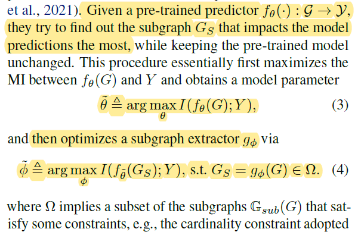
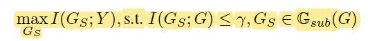
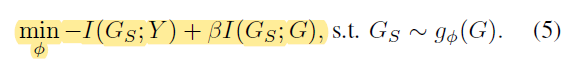
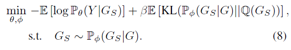
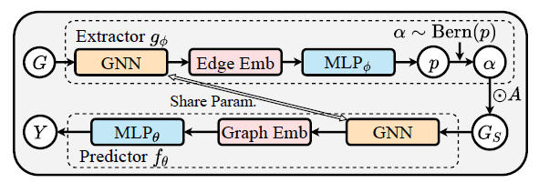

## GRAPH COARSENING WITH NEURAL NETWORKS (ICLR'21)

>From Zhihu: 图粗化(graph coarsening)[23] 和图凝结(graph condensation)[24] 的问题也可以归为这个领域，其目标是从初始大图生成精细的图。前者更注重寻找从原始节点到聚合节点的满射映射，后者从头开始生成压缩图。
>
>Related work: GRAPH CONDENSATION FOR GRAPH NEURAL NETWORKS (ICLR'22)
>
>**生成小图**一般有如下方法：
>
>* 图稀疏化
>
> Allen-Zhu, Z., Liao, Z., & Orecchia, L. (2015, June). Spectral sparsification and regret minimization beyond matrix multiplicative updates. In *Proceedings of the forty-seventh annual ACM symposium on Theory of computing* (pp. 237-245).(STOC)
>
> Lee, Y. T., & Sun, H. (2018). Constructing linear-sized spectral sparsification in almost-linear time. *SIAM Journal on Computing*, *47*(6), 2315-2336.(SIAM)，该篇文章通过线性时间去除边达到稀疏化的效果，不过似乎也针对同质图，代码见于https://github.com/mendoza95/SpectralSparsifier_LeeSun.git
>
>
>
>* 图粗化(coarsening)
>
>* 图的深度学习：聚焦于解决
>
>* 图的深度生成模型：**Graph diffusion model**
>
>任务层面（KGTuner）和query层面（针对query的子图也采出来）

概述：图粗化的大体思路是将一个大图grouping成小图，是一种无监督学习；首先是确定小图的点（大图点v到小图点$\hat{v}$由满射$\pi:V\to\hat{v}$定义），有现成工作[[1]](http://proceedings.mlr.press/v80/loukas18a/loukas18a.pdf)[[2]](https://www.jmlr.org/papers/volume20/18-680/18-680.pdf)，也可以选择$\pi(v)=\pi(v')$，其中v'是v在大图上的最近邻；其次是确定小图点间的边，小图间的边的权重由一个映射决定，映射的参数由可学习的NN学习得到，输入是一个子图$\pi^{-1}(u)\cup \pi^{-1}(v)$，输出是权重。Loss是图粗化后谱图稀疏化损失（拉普拉斯算子和瑞利熵等）。

**采图的优化方向**

评价：图谱理论有点看不太懂。对于KGTuner来说，抽取KG小图似乎用不了（因为这种方法似乎只能用于同质图，且会丢下一些小的譬如三角形的结构），不过Related Work提供了一个较为完整的回顾。

## Interpretable and Generalizable Graph Learning via Stochastic Attention Mechanism  (ICML'22)

概述：传统的提取可解释小子图的方法是先训练大模型再训练模型提取器，即事后解释方法，该文章将二者联合训练，提出一种随机注意力机制，同时提高了解释性和模型准确率

REF：[【ICML2022】基于随机注意力机制的可解释和广义图学习 - 知乎 (zhihu.com)](https://zhuanlan.zhihu.com/p/551242894)

互信息：$I(a,b):=\sum_{a,b}P(a,b)\log\frac{P(a,b)}{P(a)P(b)}$

Post-hoc GNN Interpretation: 先train GNN的参数，然后再train一个子图提取器（GNNExplainer和PGExplainer采用此种方法）

事后解释存在问题：1）有偏见的先验知识：事后解释需要加入稀疏化/连接性约束来获得数据特征，而这种先验知识具有偏见性；2）模型可能会捕捉无用特征；3）模型未在子图上训练过，因此可能欠拟合

gumble-softmax reparameterization trick：可以从离散分布中选

总体的优化目标

化为

其中第一项是一个交叉熵，第二项是一个正则项，实际上保证了所取的子图是最有代表的图

最后可以化为，认为Q(G_s)实际上是每个边按照伯努利p=r的概率分布

整体流程是对node进行embedding，然后边利用两个node的embedding经过一个MLP获得抽样概率，该概率即为最后选为子图的概率

Summary：

HPO是双层优化，如果加上采图就应该是三层优化问题

首先的问题是，采出来的图如何度量好坏，**surrogate model**，度量两个图的相似度，也可以返回一个特征值

一种方案：类似于提取子图的事后解释方法，先训model然后采子图 —— KGE没有解决怎么采子图，反而可能变复杂（x）

一种方案：能不能类似NIPS'22的工作，按照边的概率分布采子图train，然后更新分布 （x）

* tricky：先训练embedding model，有每条边的概率分布，对整个空间都有把握，热启动，区分重要程度/难易程度等，但本质上没有解决需要什么子图的问题

一种方案：能不能采一堆子图认为是不同source tasks-HPO  搞transfer - 似乎可行

**graph kernel model**：拿到不同子图之后，如何挑取，判断子图好坏，可以查查

* 比如都裁出1/5，随机采100HP 子图上全测一遍，能拿到groundtruth的correlation，看看哪一种kernel model能逼近，找找代码库等等
* 小图也可以多试点size，kernel function可能跟size有关

再试试不同采样方法：k-core，看看还有什么

先搭一个框架，两个图都测测

以上方法均可以在一张大的图上先利用一些稀疏或是剪枝的方法获得一个小的子图再采子图
