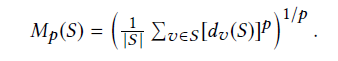
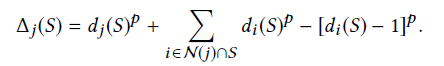
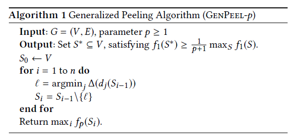
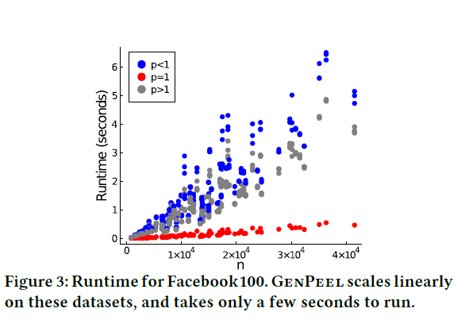
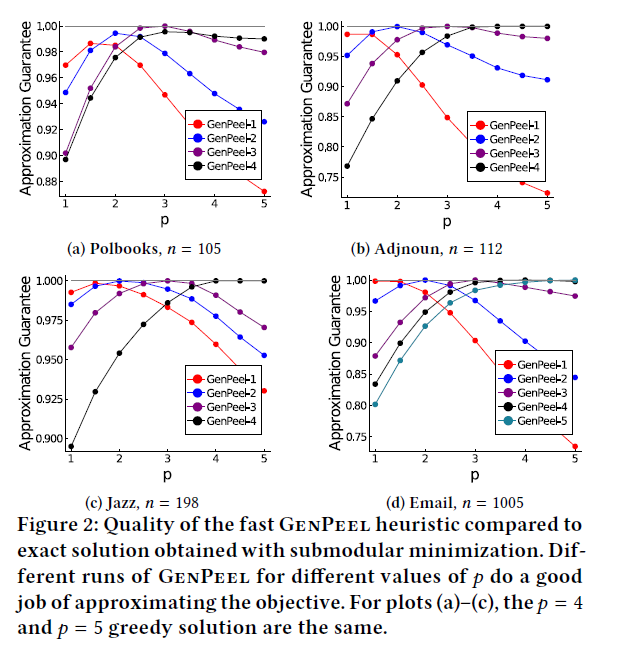

## CS224W Lecture 12 by Jure Leskovec

Node-induced subgraph：选子节点集V'，$E'=\{(u,v) | u\in V', v\in V' \}$
Edge-induced subgraph：同样也称为non-induced subgraph

Q：为什么random-walk用

Isomorphism图同构：双射定义，无法证明是否是NP-hard问题，也无多项式解法
* 子图的定义利用了同构，推断一个图是否是另一个图子图是NP-hard的

Motif：recurring（频繁） , significant patterns（小诱导子图） of interconnections
* ER random graph: (n, p) ，n个节点，节点之间是否连线服从p的伯努利分布
* Configure model：
* Switching： 随机交换两条边，进行若干次
* Z-core: 衡量一个motif的重要性

子图匹配
* 基于嵌入
	* 选择锚点anchor node，然后检索k-hop邻域，最后将邻域的子图用GNN嵌入
	* Order Embedding Space: 偏序，如果是子图，那么有embedding的vector在所有维度上都小于另一个vector，这样满足了传递性、反对称性
	* Loss function与子图有关，采用max-margin loss
	* 正采样：BFS，所有遍历到的有一定概率被选中，然后继续传播（传播深度一般3-5hop）；负采样：破坏子图，删边或者删点

寻找最大频率子图（Frequent Pattern Mining）
* counting：利用GNN预测频率；之后enumerating：小子图一点点长大，而不必枚举所有可能k节点子图 

* [SPMiner(ICML'20 Workshop)](http://snap.stanford.edu/frequent-subgraph-mining/)
	
	* 将图映射到高维采用子图匹配的类似方法
	
	* 估计频率：将大图随机采样生成许多子图，投影到order embedding space上，目标是让motif一点点长大，左下角盖住尽可能多的采样子图embedding，每一步都是贪心
	
	  

## The Generalized Mean Densest Subgraph Problem (KDD'21)

### Summary

k-core的算法是按照贪心每次剥离度数最小的点，称之为SimplePeel，最稠密子图的算法也类似，本文定义了一个更抽象的问题，将二者统一，并且为该问题提出了一种类似的贪心算法.

### Related Work

* k-clique densest subgraph，寻找子节点集S最小化$\frac{\#\ of\ k-cliques}{|S|}$，有近似算法可以在多项式内达到1/k近似
* F-density: 定义了F-graph，最大化F-graph个数和|S|的比值，当F-graph比较特殊时，可以退化为p=2的广义平均最稠密子图
* Discounted average degree and f-densest subgraph. $max\frac{|E_S|}{f(|S|)}$

### Definition

* 广义平均，设有n个数x_1, ..., x_n

  $M_p(x)=(\frac{1}{n}\sum (x_i)^p)^{1/p}$

  $M_\infty(x)=min\{x_i\};M(x)_{-\infty}=max\{x_i\};M_0(x)=(\prod x_i)^{1/p}$

* **p-mean densest subgraph**

  

  p=-∞，退化成求k-core的最大k的子图，maxcore

  p=1，退化成求最大平均密度子图

### Motivation

原有工作：近似算法SimplePeel，使用贪心算法一层层剥离掉度数最小的点，但可以证明这种算法对于该问题近似程度较差

改进思路：SimplePeel的算法较差原因是删除最小度数节点也会导致与之相连的所有节点度数-1，而在p次幂的作用下，对分母的影响可能很大，下面定义了影响：

整体算法：简单的贪心剥离影响最小的点

可以证明：1. 是$(p+1)^{1/p}$近似，近似效果更好  2.O(nm)，但实际上要快上一些

### Experiment

1. 时间近乎线性

2. 近似效果好（尤其是迭代次数较大时）

   

想法：能不能不抽子图，生成一个小的近似图作为surrogate

## MaNIACS: Approximate Mining of Frequent Subgraph Patterns through Sampling (KDD'21)

速度，patents数据集 n=3,923,922，e=16,522,438，速度：15min or so

Dynamic Graph Segmentation for Deep Graph Neural Networks (KDD'22)

A Spectral Representation of Networks: The Path of Subgraphs (KDD'22)

Graph Rationalization with Environment-based Augmentations  (KDD'22)

Minimizing Congestion for Balanced Dominators (KDD'22)

CLARE: A Semi-supervised Community Detection Algorithm (KDD'22)

Reinforcement Subgraph Reasoning for Fake News Detection (KDD'22)

Analyzing Online Transaction Networks with Network Motifs (KDD'22)

