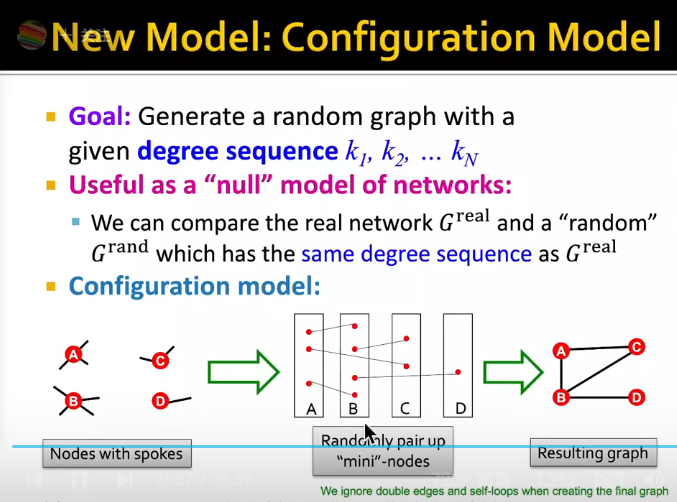
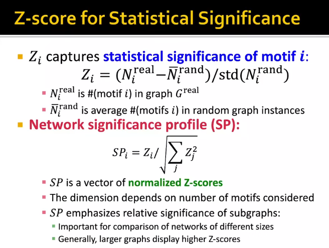
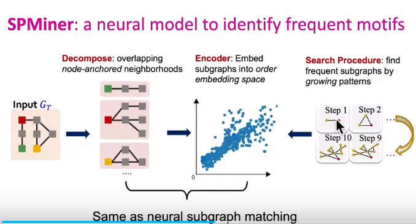
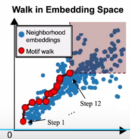
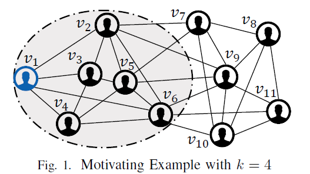
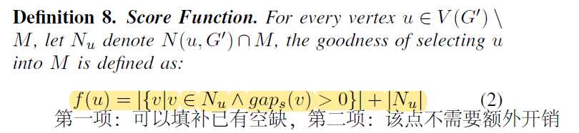
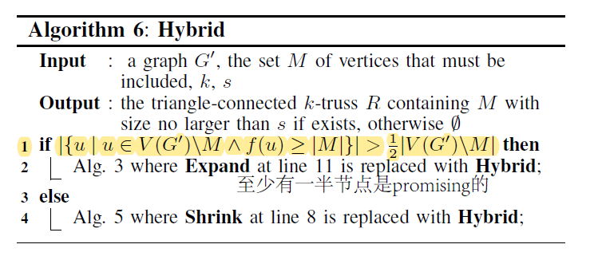
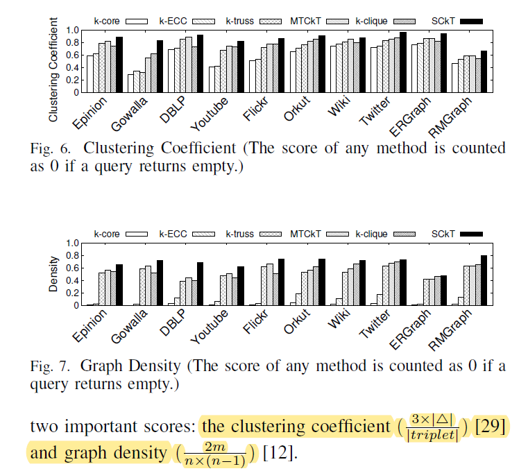
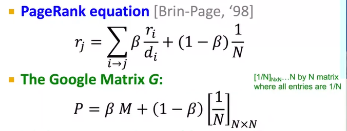

## The Generalized Mean Densest Subgraph Problem (KDD'21)

### Summary

k-core的算法是按照贪心每次剥离度数最小的点，称之为SimplePeel，最稠密子图的算法也类似，本文定义了一个更抽象的问题，将二者统一，并且为该问题提出了一种类似的贪心算法.

### Related Work

* k-clique densest subgraph，寻找子节点集S最小化$\frac{\#\ of\ k-cliques}{|S|}$，有近似算法可以在多项式内达到1/k近似
* F-density: 定义了F-graph，最大化F-graph个数和|S|的比值，当F-graph比较特殊时，可以退化为p=2的广义平均最稠密子图
* Discounted average degree and f-densest subgraph. $max\frac{|E_S|}{f(|S|)}$

### Definition

* 广义平均，设有n个数x_1, ..., x_n

  $M_p(x)=(\frac{1}{n}\sum (x_i)^p)^{1/p}$

  $M_\infty(x)=min\{x_i\};M(x)_{-\infty}=max\{x_i\};M_0(x)=(\prod x_i)^{1/p}$

* **p-mean densest subgraph**

  

  p=-∞，退化成求k-core的最大k的子图，maxcore

  p=1，退化成求最大平均密度子图

### Motivation

原有工作：近似算法SimplePeel，使用贪心算法一层层剥离掉度数最小的点，但可以证明这种算法对于该问题近似程度较差

改进思路：SimplePeel的算法较差原因是删除最小度数节点也会导致与之相连的所有节点度数-1，而在p次幂的作用下，对分母的影响可能很大，下面定义了影响：

整体算法：简单的贪心剥离影响最小的点

可以证明：1. 是$(p+1)^{1/p}$近似，近似效果更好  2.O(nm)，但实际上要快上一些

### Experiment

1. 时间近乎线性

2. 近似效果好（尤其是迭代次数较大时）

   

想法：能不能不抽子图，生成一个小的近似图作为surrogate

## CS224W Lecture 12 by Jure Leskovec

Node-induced subgraph：选子节点集V'，$E'=\{(u,v) | u\in V', v\in V' \}$
Edge-induced subgraph：同样也称为non-induced subgraph

Q：为什么random-walk用

Isomorphism图同构：双射定义，无法证明是否是NP-hard问题，也无多项式解法
* 子图的定义利用了同构，推断一个图是否是另一个图子图是NP-hard的

Motif：recurring（频繁） , significant patterns（小诱导子图） of interconnections
* ER random graph: (n, p) ，n个节点，节点之间是否连线服从p的伯努利分布
* Configure model：
* Switching： 随机交换两条边，进行若干次
* Z-core: 衡量一个motif的重要性

子图匹配
* 基于嵌入
	* 选择锚点anchor node，然后检索k-hop邻域，最后将邻域的子图用GNN嵌入
	* Order Embedding Space: 偏序，如果是子图，那么有embedding的vector在所有维度上都小于另一个vector，这样满足了传递性、反对称性
	* Loss function与子图有关，采用max-margin loss
	* 正采样：BFS，所有遍历到的有一定概率被选中，然后继续传播（传播深度一般3-5hop）；负采样：破坏子图，删边或者删点

寻找最大频率子图（Frequent Subgraph Pattern Mining）
* 难点：枚举可能子图和查询子图频率均是NP-hard的

* counting：利用GNN预测频率；之后enumerating：小子图一点点长大，而不必枚举所有可能k节点子图 

* [SPMiner(ICML'20 Workshop)](http://snap.stanford.edu/frequent-subgraph-mining/)
	
	* 将图映射到高维采用子图匹配的类似方法
	
	* 估计频率：将大图随机采样生成许多子图，投影到order embedding space上，目标是让motif一点点长大，左下角盖住尽可能多的采样子图embedding，每一步都是贪心
	
	  

## MaNIACS: Approximate Mining of Frequent Subgraph Patterns through Sampling (KDD'21)

### Summary

寻找最大频率子图。最大频率子图从一个点开始长大，利用对称性(orbit概念)、剪枝等优化枚举子图的过程，并利用特殊的采样和VC维理论证明限制频率计算的误差。（具体证明、算法细节过于繁琐，并未看懂。）该算法计算速度较快，patents数据集 n=3,923,922，e=16,522,438，速度：15min or so，子图规模大约在10k的量级。

### Background

最大频率子图（已在上篇cs224w letcure12里叙述）

Subgraph counting tutorial：[www19-subgraph-counting-tutorial-refs.pdf (ucsc.edu)](https://users.soe.ucsc.edu/~sesh/subgraph_counting/www19-subgraph-counting-tutorial-refs.pdf)

### Contribution

* 以往依靠采样的算法没有保证结果的近似度，本方法采用VC维等理论**证明了算法的误差上界**
* 利用 MNI-frequency measure剪枝搜索空间
* 速度快，效果好，误差低于理论上界

想法：借助Frequent Subgraph Patterns在原图上抠出一块与Most Frequent Subgraph相近的子图；抑或是以此图为中心向外k-hop作为最终子图

## Efficient Community Search with Size Constraint (ICDE'21)

### Background

k-truss：图的一条边包含在k个三角形中，则support(e)=k，k-truss是一个极大子图，所有边support>=k-2

k-truss是k-core的升级版，基于以下假设：三角关系通常具有牢固稳定的关系，一个社区的两个点必然可以通过一系列三角形到达；与此同时，蛋白质相互作用等生物关系网络的三角关系也具有非常重要作用

> 相关概念：k-core，k-truss，k-ECC（去掉任何k-1条边后依然连通），k-clique，k-club，p-cohesion，k-edge/vertex connected，k-shell
>
> $(\alpha,\beta)-core$  [25]Liu et al.(WWW'19)  [41]Wang et al.(ICDE'21)
>
> (k,p)-core [45]Zhang et al.(ICDE'20)
>
> 还有一些衡量两个节点在结构中的相似性[9]

SCkT想解决的问题是：寻找到一个k-truss子图，包含给定query vertices集合Q，同时图的节点数不超过k（下图给出k=4,s=6,Q={v1,v6}的一个例子，灰色阴影为所求子图），该问题是本文作者自己定义的，并且给出了该问题是NP-hard的证明

规模受限的搜索：局限于计算开销等，规模受限在有些情况下是必要的。

### Methods

首先，该文章用理论给出一个估出需要节点数量的下界，如果s小于下界则无解

设已选点集为M（初始为必选点），则定义剩下的点score为

定义两种操作：Expand，选取score最高的点加入M并更新induced graph；shrink，选取M内score最小的点从M中删去

事实上，Expand和Shrink均可单独作为dfs过程的策略进行搜索（只不过初始状态不同）

该文章采用Hybrid方法，即节点普遍score高时（注意Score的取值范围为0-|M|）expand；否则shrink

### Experiment

速度：在一张4千万节点和15亿边的图上，对于95%的query，生成图时间小于10s

## Pagerank

* Flow Model: 重要性取决于指向他的节点的重要性，而该重要性又平均流向下游节点，如果假设所有节点重要性$r_i$和为1，那么有$r=Mr$，其中$M_{ij}=\frac{I(\exist edge(i,j)\in E)}{degree(v_i)}$
* Random walk: 设$r$为一个随机游走的人落在第i号节点的概率向量，那么$r(t+1)=Mr(t)$，稳定状态下（时间无限长）有$r=Mr$
* Power Iteration Method: i) 随机初始化r； ii) 更新r(t+1)=Mr(t)； iii) 直到$|r(t+1)-r(t)|<\epsilon$停止；大约50次迭代足够停止
  * 有可能因为陷入某个点而吸收所有重要性(Dead Ends)：解决方案是以一个小概率$1-\beta$传送到一个任意一个节点（$\beta\approx0.8 \sim0.9$）

两种思路：一种surrogate graph，一种直接prune

prune: k-core、clustering、frequent subgraph pattern mining([FSPM review](https://ieeexplore.ieee.org/abstract/document/9399267))

Betweenness Centrality：连接度、重要性等，是否能结合k-core

ABRA: Approximating Betweenness Centrality in Static and Dynamic Graphs with Rademacher Averages  (TKDD'18)

Dynamic Graph Segmentation for Deep Graph Neural Networks (KDD'22)

A Spectral Representation of Networks: The Path of Subgraphs (KDD'22)

Graph Rationalization with Environment-based Augmentations  (KDD'22)

Minimizing Congestion for Balanced Dominators (KDD'22)

CLARE: A Semi-supervised Community Detection Algorithm (KDD'22)

Reinforcement Subgraph Reasoning for Fake News Detection (KDD'22)

Analyzing Online Transaction Networks with Network Motifs (KDD'22)

