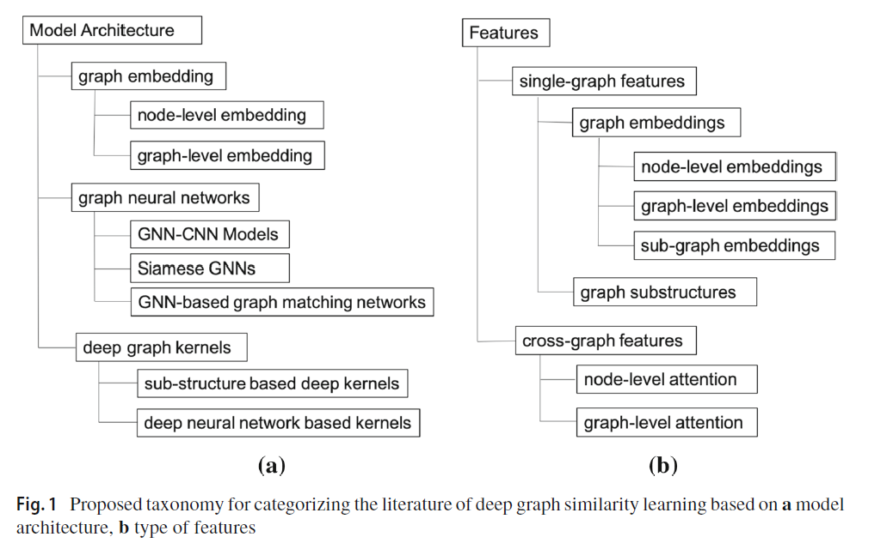
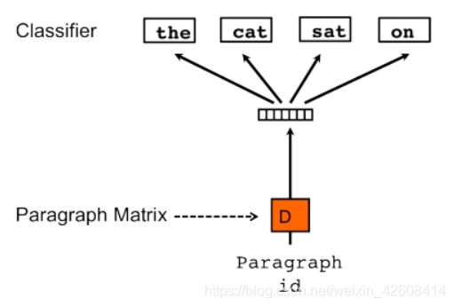
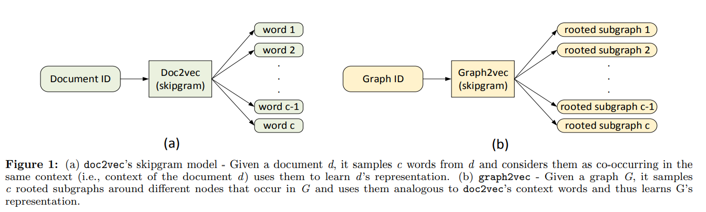
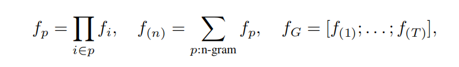

## Deep graph similarity learning: a survey

图相似性分类

个人还可以分类为：神经网络学习model-based、NP问题抽象的近似解isomorphism-problem-based

features: 利用一个图的特征、利用不同图的跨图特征

下游任务： 社交网络分析、生化分子、脑神经科学

* Graph embedding based

  * node-level

    * **Matching Node Embeddings for Graph Similarity** (AAAI'17)

      根据邻接矩阵的特征向量将每个node embed成向量，然后一堆向量合起来形成集合，用Earth Mover Distance衡量两个集合的距离，也即graph的距离

  * graph-level

    * graph2vec (arxiv‘19)
    
      类比NLP领域中的doc2vec：doc2vec实际上要获得一个doc的embedding，其中一种方法类似于skip-gram（通过一个词预测周围的词），通过doc的embedding预测word是否在doc来更新doc（以及word）的embedding。graph2vec将一个rooted-subgraph视作词，将整张图视作doc，通过一个子图是否在大图中来更新。与此同时，考虑到子图众多，可以采用负采样，随机抽取从不在该图中的词汇表进行更新。
    
      想法：这种NLP模型(n-gram等)，如mask掉一个node通过上下文更新，再或者通过上文(head)预测下文(tail)的方法和KG挺像的，就是不知道NLP领域word之间的space有没有relation
    
      最好不需要学，也可以学一个kernel
    
      
    
      
    
    * structure2vec (ICML'16)
    
      聚合邻居信息，似乎与不动点迭代有关
    
    * SEED: sampling, encoding, and embedding distributions (ICLR'19)
      
      首先用random walk改进版本WEAVE采一堆子图，然后通过对子图编码再解码和原图对比训练一个autoencode和一个autodecoder，训练好autoencode后，将G和H图sample出一些子图（即相似性衡量为子图分布概率之差），分别encode成一组向量$\{z_i\}\{h_i\}$，然后两个图借助sample出的子图向量，通过一个映射$\phi$（衡量图相似性的核方法中利用的）得到
      
      $\mu_G=\frac{1}{k}\sum \phi(z_i); \mu_H=\frac{1}{k}\sum \phi(h_i)$
      
      在本实验中采用$\phi(z_i) = z_i$； 两图相似性为$MMD(G,H)=||\mu_G-\mu_H||_2$
      
      借鉴之处：WEAVE改进版
      
      **中间变量存下来，看看能不能存kernel搞出来的vector**
      
      **看看kernel怎么算**
      
      **random walk**
      
    * N-Gram graph embedding (NIPS'19)
    
      首先先进行node embedding，方法就是通过mask掉一个node，通过邻居预测该节点，然后两个进行cross-entropy；其次进行graph embedding（在NLP领域中n-gram是指一个文章中长度为n的滑动窗口，可以理解为假设当前词只与前n-1个词有关，因此是一个连乘的条件概率），如下图
    
      
    
      其中$f_i$表示节点i的node embedding，$p$是最终节点，$i\in p$是到达p的长度为n的一条路径，连乘是类比于条件概率连乘（？）；最终所有可能路径加和得到$f_{(n)}$，各个n拼起来成为G的embedding
    
      **KGE node embedding，可以check一下N-gram的node embedding是啥**
    
      **KGE的各个embedding 1. 可以用于下一个config训练（*，验证一下）  2. 可以尝试mean或者什么映射到空间，比较similarity**
  
* GNN-based

  * 略（可能会很慢）

* kernels

  * 略（后面阅读一下graph kernel相关综述）

想法：图核中random-walk-based-kernel等图核事实上就是通过random walk采小子图看同构，这与我们采子图很像——不妨直接比较哪个random walk出来的小子图和所有其他子图都很像（可以再读一读random walk kernel相关文章）

实验：小子图之间可以用复杂度高的graph kernel

## Matching Node Embeddings for Graph Similarity (AAAI'17)

概括：这是一种名为PyramidMatch 的graph kernel，主要基于pyramid match的核改进而来，它基于邻接矩阵复杂变形，实质上可以视为将节点变换为一种升级版的特征向量....然后通过一些核方法（还没看完..）。它突破了传统graph kernel局限于小的局部结构（如随机游走采样、最短路、子树、graphlet等），考虑了全图结构

### Motivation

传统graph kernel局限于小的局部结构（如随机游走采样、最短路、子树、graphlet等），忽略全局结构；一些考虑全局结构的却没有考虑labeled-graph

问题：无向

**实质上比较A三维矩阵[N,N,R]这种之间的相似度，比较矩阵相似度有一些成熟方法 矩阵特征值**

把每个kernel的计算方法都列出来总结一下，截取公式等

**saveembedding，一方面试graph embedding 一方面直接初始化下一个HP（小图）**

**读paper没必要看特别细——找到一个简单有效的方法，数学原理可以不用太细**
